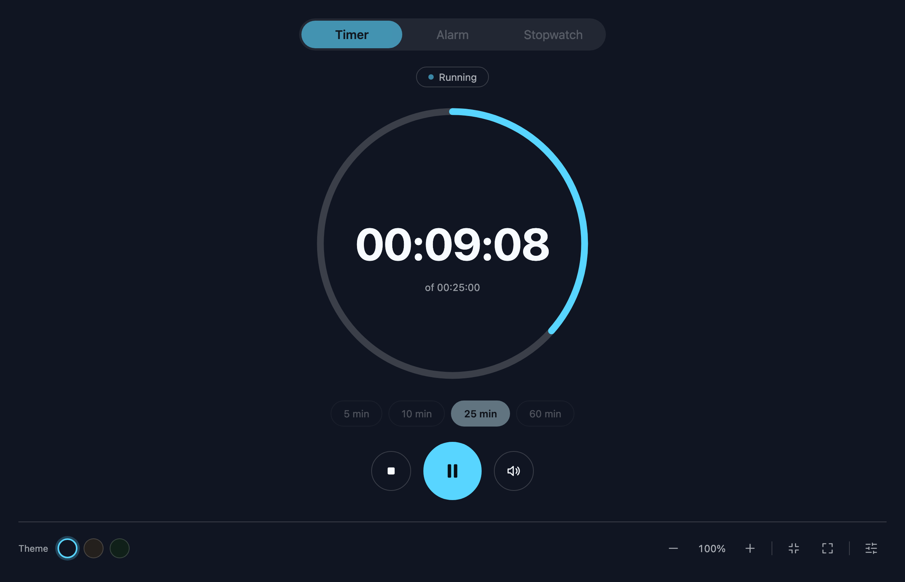
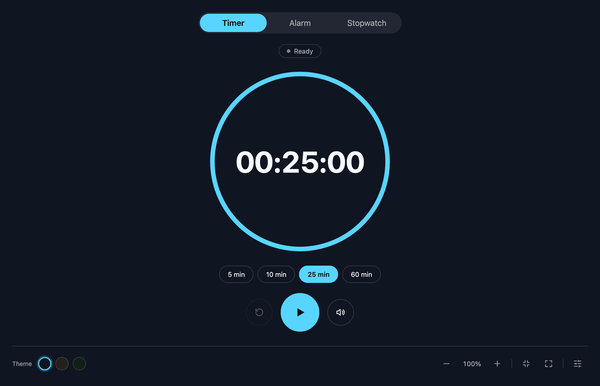
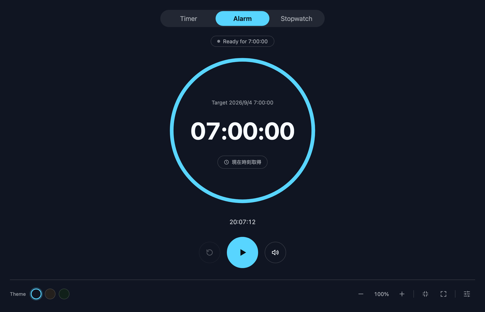
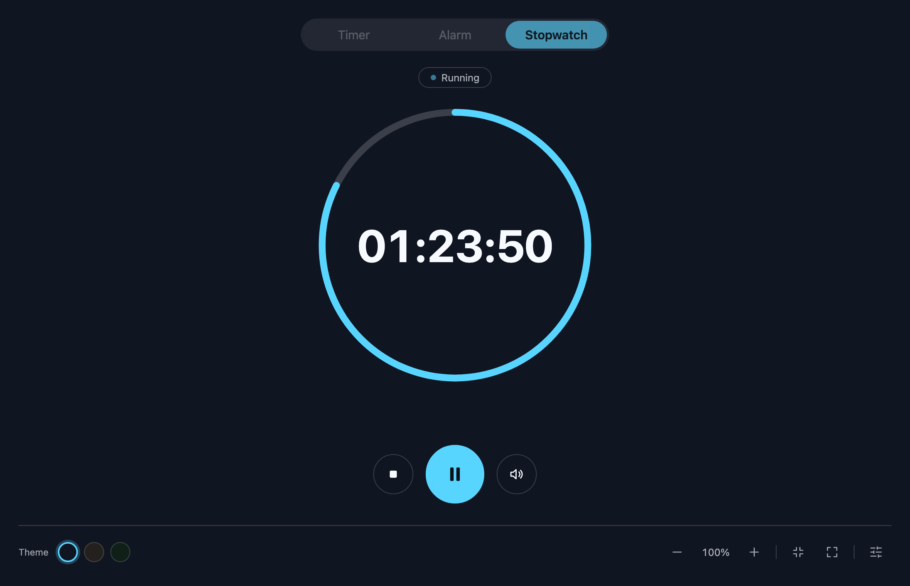
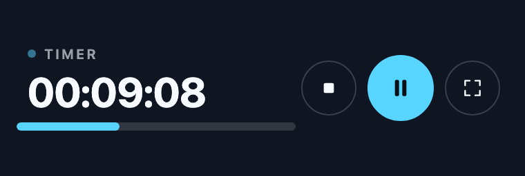
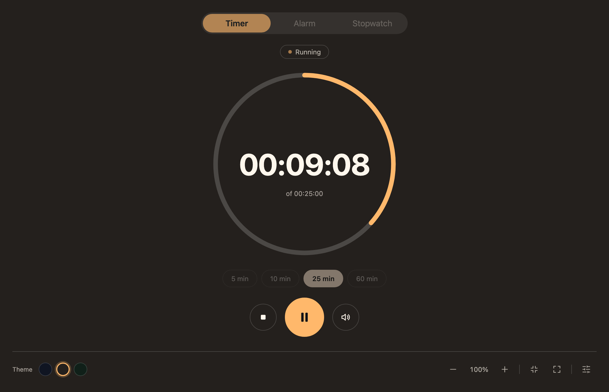
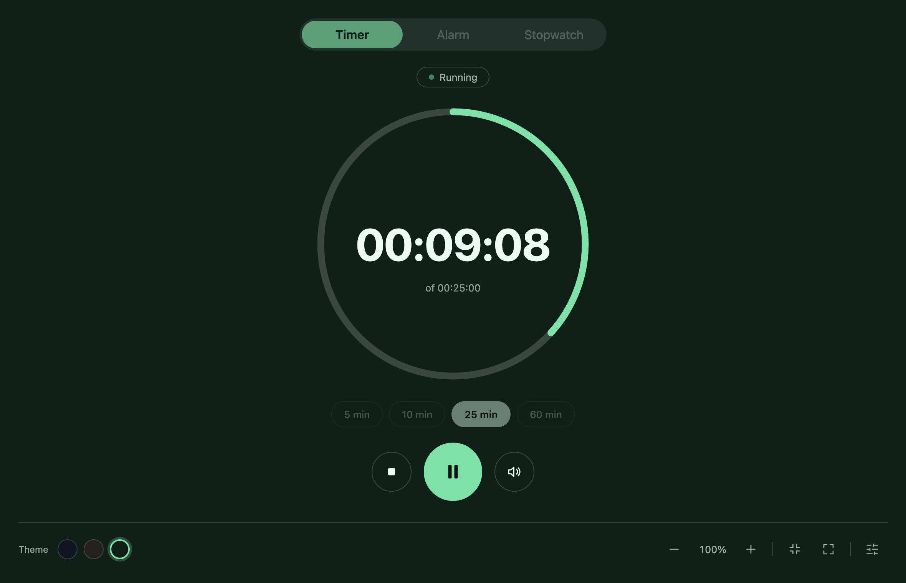

# RingTimer

<p align="center">
  
</p>

リング(円形)デザインのタイマー・アラーム・ストップウォッチが使える、Windows/Mac用のデスクトップアプリです。

このアプリは Electron・React・Vite という技術で作られていますが、使う上でこれらを理解する必要はありません。以下の手順どおりに進めれば動かせます。

> このリポジトリには、自動生成される `node_modules` フォルダ・`dist` フォルダ・`release` フォルダは含まれていません。新しいパソコンで使い始める際は、まず「初期セットアップ」を行ってから、必要なものを作り直してください。

## 画面

3つのモードをタブで切り替えて使います。

| Timer(タイマー) | Alarm(アラーム) | Stopwatch(ストップウォッチ) |
| --- | --- | --- |
|  |  |  |
| 決めた長さをカウントダウンします。5/10/25/60分のボタンでよく使う時間をすぐにセットできます。 | 指定した時刻に鳴らします。「現在時刻取得」ボタンで今の時刻を呼び出せます。 | 経過時間を計測します。リングは1分で1周します。 |

### ミニマル表示

画面右下の縮小アイコンを押すと、ウィンドウが横長の細いバーに変わります。作業画面のすみに置いたまま残り時間を確認したいときに使います。元のサイズに戻すときは、バー右端のアイコンを押すか `Esc` キーを押してください。




## 必要なもの

- Node.js(JavaScriptを動かすための実行環境)
- npm(Node.jsに付属しているパッケージ管理ツール)
- Windows または macOS のパソコン

Node.jsをインストールすると、npmも自動的に使えるようになります。

## 初期セットアップ

このアプリを動かすために必要な部品(ライブラリ)をダウンロードします。フォルダ内で以下のコマンドを1回実行してください。

```bash
npm install
```

## 開発モードで起動する(動作確認用)

アプリをすぐに試してみたいときはこちらです。

```bash
npm run dev
```

このコマンド1つで、裏側の準備(Vite開発サーバー)が起動してから、アプリのウィンドウ(Electron)が自動的に開きます。

## 配布用のアプリファイルを作る(パッケージング)

「ダブルクリックで起動できるアプリ」を作りたい場合は、それぞれの環境で以下のコマンドを実行します。

> 注意: Windows用のアプリはWindowsパソコンで、Mac用のアプリはMacパソコンで作成してください。他のOS上で作ることは想定していません。

### Windows用アプリを作る

```bash
npm install
npm run pack:win
```

実行すると、以下の場所にアプリが作られます。

```text
release\RingTimer-win32-x64\
```

このフォルダの中の `RingTimer.exe` をダブルクリックすると起動します。

### Mac用アプリを作る

```bash
npm install
npm run pack:mac
```

実行すると、パソコンの種類に応じて以下のどちらかの場所にアプリが作られます。

```text
release/RingTimer-darwin-arm64/   (Apple Silicon搭載Mac用)
release/RingTimer-darwin-x64/     (Intel搭載Mac用)
```

このフォルダの中にある `.app` ファイルを開くと起動します。

## テーマ(見た目)のカスタマイズ

アプリ右下の歯車アイコンから設定パネルを開くと、背景色・文字色・アクセントカラー・アラーム音を自由に変更できます。作った見た目は「テーマ」として保存でき、JSONファイルへの書き出し(エクスポート)や読み込み(インポート)もできます。

最初から3つのテーマが用意されています。

| Midnight | Studio | Forest |
| --- | --- | --- |
|  |  |  |

### アラーム音の自動停止

時間になってアラームが鳴りはじめたあと、一定時間が過ぎると**音だけが自動的に止まります**。停止までの時間は設定パネルの「Auto-stop」で選べます(Off / 30秒 / 1分 / 3分 / 5分 / 10分、初期値は5分)。

音が自動的に止まったあとも、「時間になった」という表示は画面に残ります。席を外していても、戻ってきたときにアラームが鳴ったことが分かります。表示は「Dismiss」ボタンを押すと消えます。

「Off」を選ぶと自動では止まらず、「Dismiss」を押すまで鳴り続けます。

### 背景に画像を表示する

- 設定パネルの「Background Image URL」欄に、インターネット上に公開されている画像のURL(`http://...` や `https://...` で始まるもの)を入力し、「Show background image」をオンにすると、その画像がタイマーの背景に表示されます。画像の上には半透明の膜がかかるので、文字は隠れず読みやすいままです。
- この機能は画像そのものをアプリに保存するわけではなく、「画像のURL(場所)」だけを覚えておく仕組みです。そのため、以下の点にご注意ください。
  - 表示するたびにインターネットから画像を読み込むため、ネット接続とURLが有効であることが必要です。URLが無効になった場合、エラー表示は出ず、静かに元の背景色に戻ります。
  - テーマをエクスポート/インポートしても、画像データそのものは含まれず、URL(文字列)だけがコピーされます。
  - 画像を読み込む際、画像を配信しているサーバーにあなたのIPアドレス(ネット接続時に使われる識別情報)が伝わります。個人情報を含む画像URLの利用は避けてください。
- 最初から用意されているテーマには、試しに使える画像URLとして `https://picsum.photos/1600/900` が設定されています(表示は初期状態でオフになっています)。これは [Picsum Photos](https://picsum.photos/) という無料の画像サービスで、自由に使ってよいものですが、常に表示できる保証はない点にご留意ください。

## アプリのアイコンについて

アイコンの元データと、そこから生成されたファイルは `assets/` フォルダに入っています。

- `icon.svg`:アイコンの元となるデザインファイル(32px以下の小さいサイズでは `icon-small.svg` が使われます)
- `icon.ico` / `icon.icns` / `icon.png`:上記から生成された、実際にアプリで使われるアイコンファイル

アイコンのデザイン(SVGファイル)を変更した場合は、以下のコマンドで他の形式のファイルを再生成してください。

```bash
npm i --no-save sharp png-to-ico @fiahfy/icns
node scripts/generate-icons.cjs
```

## リポジトリに保存されないフォルダについて

このプロジェクトでは、以下のフォルダをGit(ソースコード管理)には保存していません。

- `node_modules`(ダウンロードしたライブラリ一式)
- `dist`(開発モード用に生成されたファイル)
- `release`(配布用アプリのファイル)

そのため、別のパソコンやクリーンな環境でこのプロジェクトを使う場合は、必要なものをその都度作り直す必要があります。

- 動作確認だけしたい場合:`npm install` の後に `npm run dev`
- Windows用アプリが欲しい場合:`npm install` の後に `npm run pack:win`
- Mac用アプリが欲しい場合:`npm install` の後に `npm run pack:mac`

## コマンド一覧

```bash
npm run dev        # 開発モードで起動する
npm run build      # 配布用データ(dist)を生成する
npm run preview    # ビルドした内容をブラウザで確認する
npm run pack       # 今使っているOS用にアプリを作成する
npm run pack:win   # Windows用アプリを作成する
npm run pack:mac   # Mac用アプリを作成する
```
